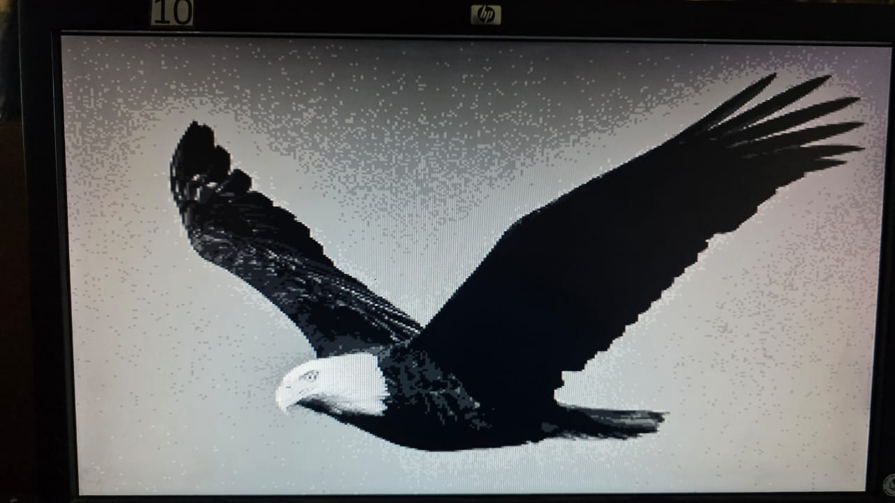
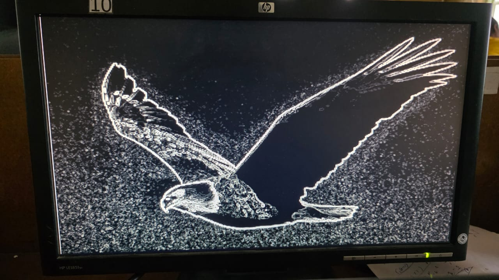

# FPGA Sobel Edge Detection Implementation

## Project Overview
This project implements a real-time Sobel Edge Detection algorithm using Verilog HDL on FPGA.  
The system processes image frames and highlights edges using gradient-based filtering.

## Technologies Used
- Verilog HDL
- Xilinx Vivado
- FPGA (Specify your board here e.g., Basys 3 / Nexys A7)
- VGA Output

## Repository Structure
- src/ → Design modules (Sobel filter, VGA controller, memory, top module)
- sim/ → Testbenches
- constraints/ → XDC constraint files
- docs/ → Project documentation and reports

## Features
- Real-time Sobel edge detection
- VGA display output
- Memory-based frame processing
- Modular Verilog design

## How to Run
1. Open project in Vivado
2. Add source files from src/
3. Add constraint file from constraints/
4. Run synthesis → Implementation → Generate Bitstream
5. Program FPGA

## Results

### Original Frame

### Edge Detected Output (VGA out of the Board)

## Author
H.A.J.D Rathnasiri
EE587 University of Peradeniya/ FPGA Image Processing
